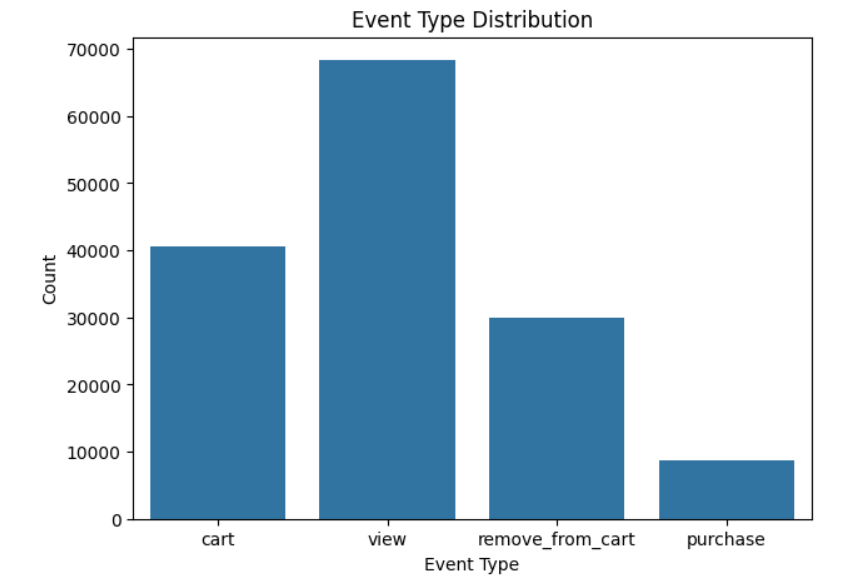
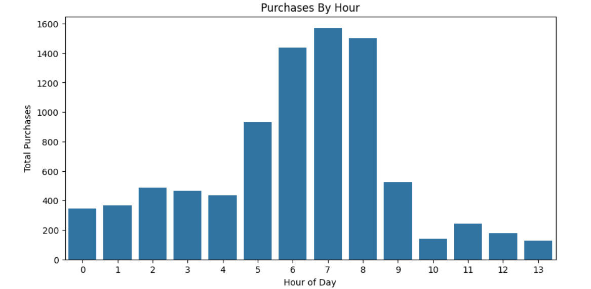
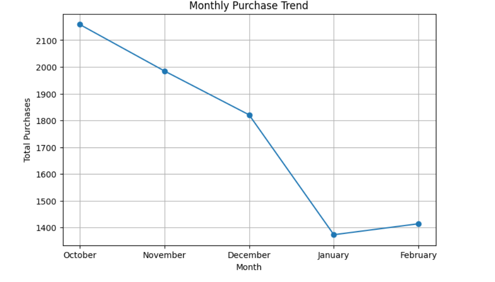
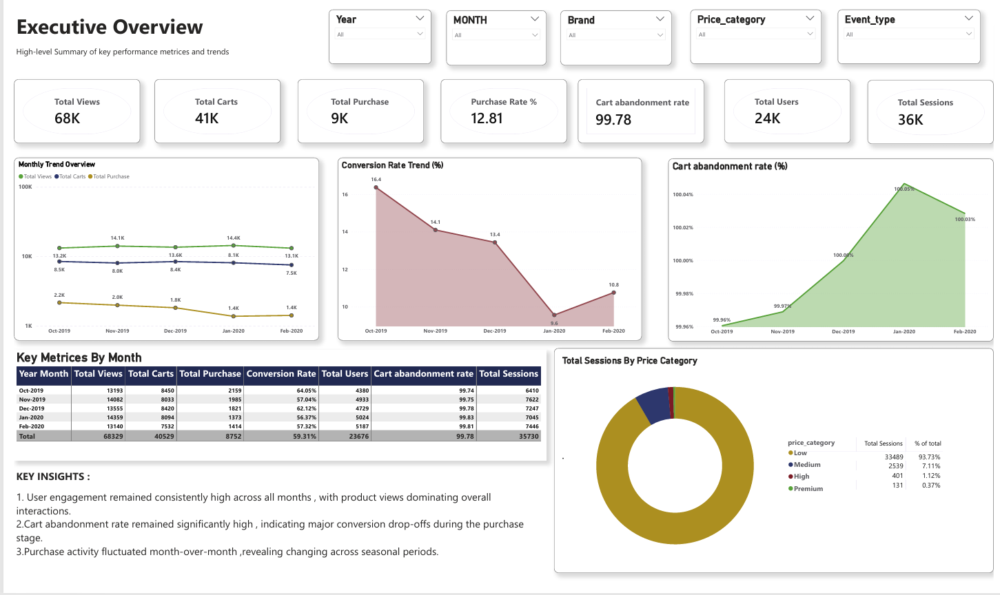
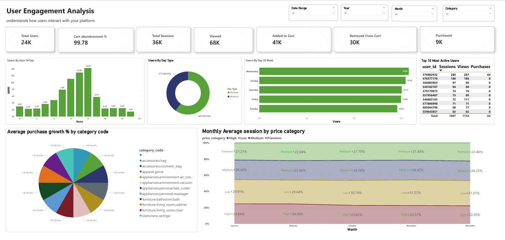
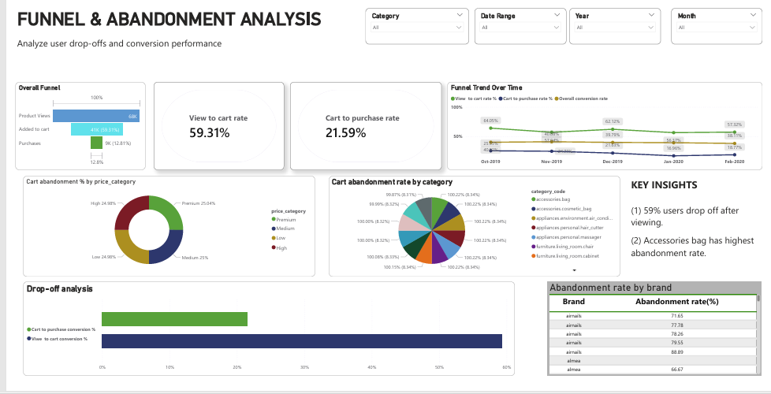

# E-Commerce Product Analytics Dashboard

# Project Overview

This project focuses on analyzing e-commerce user behavior, conversion funnels, and product performance using Python, Pandas, and Power BI.

The analysis was performed on multi-month user interaction data containing product views, cart additions, cart removals, and purchases.

# The project aims to identify:

User engagement patterns
Cart abandonment behavior
Product conversion trends
Customer interaction insights
Purchase funnel drop-offs
Category and product-level performance

# Tools & Technologies Used
Python
Pandas
NumPy
Jupyter Notebook
Power BI
DAX
Data Modeling

# Dataset Information

The dataset contains multi-month e-commerce event data with user interactions such as:

Product Views
Cart Additions
Cart Removals
Purchases

# Key columns:

event_time
event_type
product_id
category_id
brand
price
user_id
user_session

# Project Workflow
# 1. Data Cleaning & Preparation
Loaded multiple monthly datasets
Fixed datatype inconsistencies
Combined datasets into a master analytical dataset
Handled missing values
Validated event types
Created behavioral and time-based features
# 2. Feature Engineering

Created analytical features such as:

Hour
Day Name
Month Name
Weekend Indicator
Price Categories
View/Cart/Purchase Flags
User Behavioral Metrics

# 3. Business Analysis

Performed:

Funnel Analysis
Cart Abandonment Analysis
Product Conversion Analysis
User Engagement Analysis
Monthly KPI Trend Analysis
Category Performance Analysis

# Key Insights
Product views dominated overall platform activity while purchases remained comparatively low.
Significant user drop-offs were observed between cart and purchase stages.
Certain products generated high engagement but low conversion rates.
User activity peaked during specific time windows indicating strong engagement patterns.
Medium-priced products showed stronger purchase conversion compared to premium products.

# Power BI Dashboard Pages
1. Executive Overview
KPI Summary
Conversion Metrics
Monthly Trends
Engagement Overview
2. User Engagement Analysis
Hourly Activity
Weekday vs Weekend Analysis
User Sessions
New vs Returning Users
3. Funnel & Cart Abandonment Analysis
Conversion Funnel
Drop-off Analysis
Abandonment by Category & Brand

# jupyter notebook screenshots

# Dashboard Screenshots

# Business Impact

This project demonstrates how product analytics and user behavior analysis can help businesses:

Improve conversion rates
Reduce cart abandonment
Identify low-performing products
Optimize customer engagement strategies
Improve product-level decision making

# Author

Pankaj Juyal

# Skills Used:

Python
Pandas
Data Analysis
Power BI
DAX
Data Cleaning
Business Analytics
